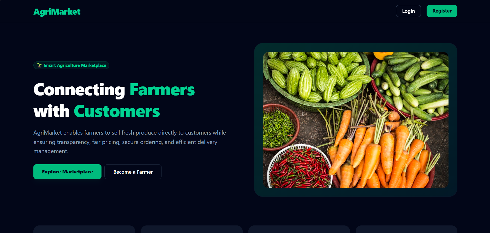
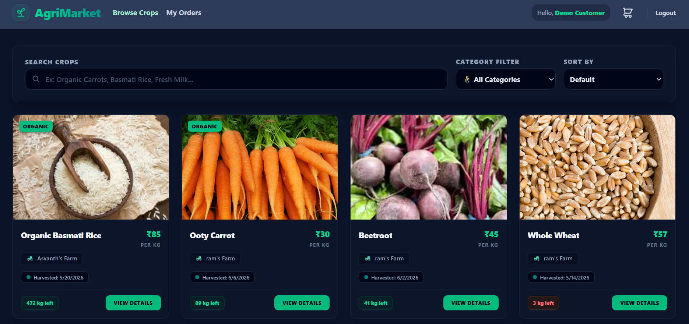
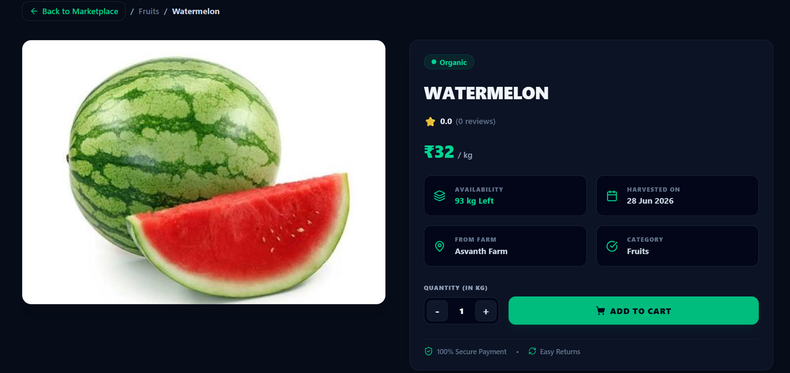
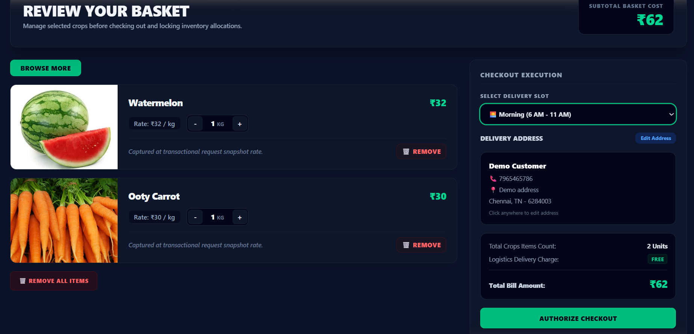
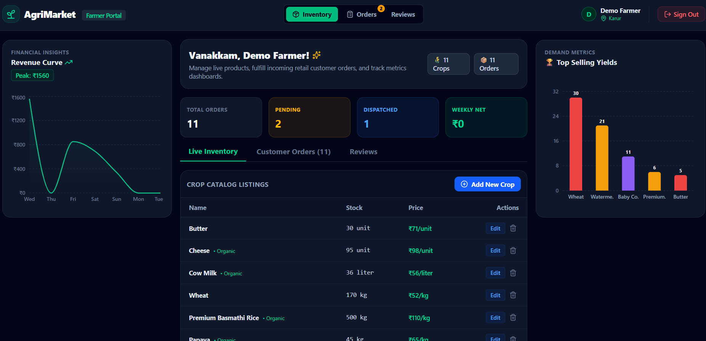
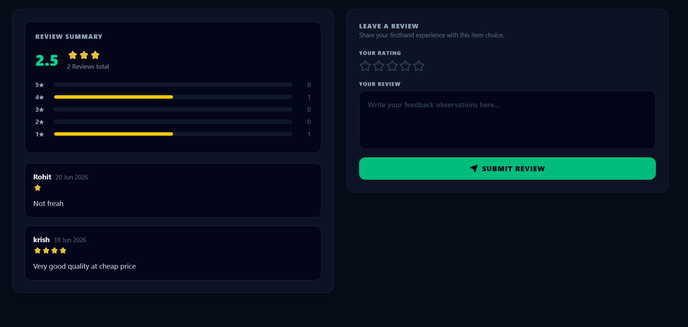
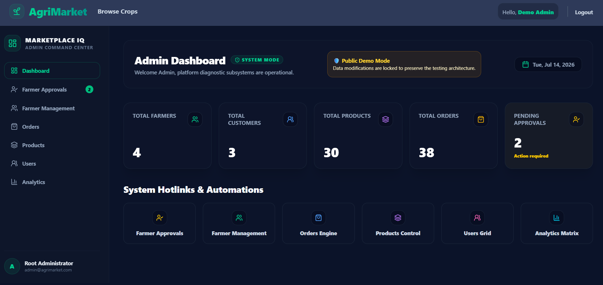
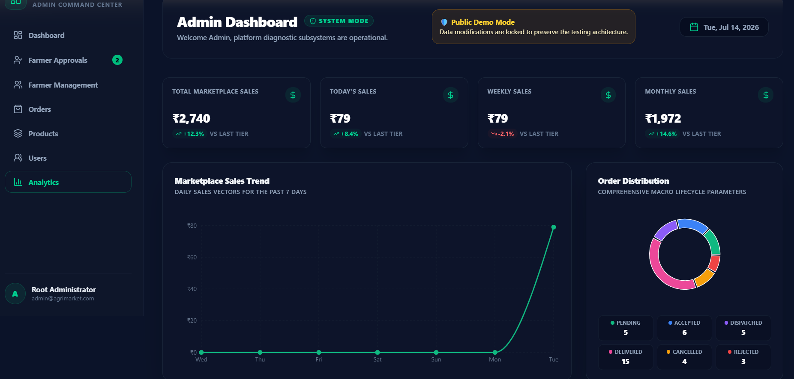

# 🌱 AgriMarket – Full Stack MERN Agricultural Marketplace

A modern full-stack agricultural marketplace built using the **MERN Stack** that connects farmers directly with customers through a secure, transparent, and user-friendly digital platform. The application enables farmers to manage products and orders while allowing customers to browse, purchase, and review fresh agricultural products.

# 🌐 Live Demo

🔗 **Application:**  
https://farmer-marketplace-sigma.vercel.app

## 💻 Technologies

React • Node.js • Express.js • MongoDB Atlas • JWT • Tailwind CSS • Cloudinary • Render • Vercel

## 🚀 Highlights

- 🌱 MERN Stack Full-Stack Application
- 🔐 JWT Authentication & Role-Based Authorization
- 👨‍🌾 Farmer, Customer & Admin Portals
- 🛒 Complete Shopping & Order Management
- ⭐ Product & Farmer Review System
- 📊 Interactive Analytics Dashboard
- ☁️ Cloudinary Image Uploads
- 📱 Fully Responsive Design
- 🚀 Deployed using Vercel & Render

# # 🔑 Demo Access
> **Demo Mode:**  
The live deployment is intended for demonstration purposes. Some write operations (such as adding, editing, deleting products or modifying orders) may be restricted to preserve application data while allowing visitors to explore the platform safely.

---

# 📸 Application Preview

Click any screenshot below to explore the live application.

| 🏠 Home Page | 🛒 Marketplace |
|--------------|----------------|
| [](https://farmer-marketplace-sigma.vercel.app) | [](https://farmer-marketplace-sigma.vercel.app/customer/marketplace) |

| 📦 Product Details | 🛍️ Shopping Cart |
|-------------------|------------------|
| [](https://farmer-marketplace-sigma.vercel.app/customer/marketplace) | [](https://farmer-marketplace-sigma.vercel.app/customer/cart) |

| 👨‍🌾 Farmer Dashboard | ⭐ Reviews Dashboard |
|----------------------|---------------------|
| [](https://farmer-marketplace-sigma.vercel.app/farmer/dashboard) | [](https://farmer-marketplace-sigma.vercel.app/farmer/dashboard) |

| 👨‍💼 Admin Dashboard | 📱 Responsive Design |
|---------------------|----------------------|
| [](https://farmer-marketplace-sigma.vercel.app/admin/dashboard) | [](https://farmer-marketplace-sigma.vercel.app) |


# ✨ Features

## 👨‍🌾 Farmer Portal

- Secure JWT Authentication
- Dashboard Analytics
- Product Management (CRUD)
- Live Inventory Management
- Order Management
- Product Reviews Dashboard
- Farmer Reviews Dashboard
- Revenue Analytics
- Cloudinary Image Upload
- Responsive Dashboard

---

## 🛒 Customer Portal

- User Registration & Login
- Browse Products
- Product Search
- Product Details
- Shopping Cart
- Checkout
- Order History
- Product Reviews
- Farmer Reviews
- Responsive UI

---

## 👨‍💼 Admin Portal

- Admin Authentication
- Dashboard Overview
- Manage Users
- Manage Products
- Manage Orders
- Platform Monitoring

---

# 📊 Dashboard Analytics

The Farmer Dashboard provides real-time insights including:

- Weekly Revenue
- Total Orders
- Pending Orders
- Dispatched Orders
- Revenue Trend Charts
- Top Selling Products
- Product Rating Summary
- Farmer Rating Summary

---

# ⭐ Review System

Customers can:

- Review purchased products
- Rate farmers
- Edit their reviews
- Delete their reviews

Farmers can:

- View product reviews
- View farmer profile reviews
- Monitor average ratings
- Track total reviews

---

# 🛠 Tech Stack

## Frontend

- React.js
- React Router
- Tailwind CSS
- Axios
- Recharts
- Lucide React

---

## Backend

- Node.js
- Express.js
- MongoDB Atlas
- Mongoose
- JWT Authentication
- Cloudinary
- Multer

---

## Deployment

- Frontend: Vercel
- Backend: Render
- Database: MongoDB Atlas

---

# 🏗 Architecture

```
            React + Tailwind CSS
                     │
                 Axios API
                     │
          Express.js REST API
                     │
      JWT Authentication Middleware
                     │
      MongoDB Atlas Database
                     │
      Cloudinary Image Storage
```

# 📁 Project Structure

```
AgriMarket
│
├── client
│   ├── src
│   │   ├── components
│   │   ├── pages
│   │   ├── context
│   │   ├── api
│   │   └── assets
│   │
│   └── public
│
├── server
│   ├── config
│   ├── controllers
│   ├── middleware
│   ├── models
│   ├── routes
│   └── uploads
│
└── README.md
```

---

# 🚀 Installation

## Clone Repository

```bash
git clone https://github.com/Asvanth16/Farmer-Marketplace.git
```

```bash
cd Farmer-Marketplace
```

---

## Backend Setup

```bash
cd server
npm install
```

Create a `.env` file

```env
PORT=5000
MONGO_URI=YOUR_MONGODB_URI
JWT_SECRET=YOUR_SECRET
CLOUDINARY_CLOUD_NAME=YOUR_CLOUD_NAME
CLOUDINARY_API_KEY=YOUR_API_KEY
CLOUDINARY_API_SECRET=YOUR_API_SECRET
FRONTEND_URL=http://localhost:5173
```

Start backend

```bash
npm start
```

---

## Frontend Setup

```bash
cd client
npm install
```

Create

```env
VITE_API_URL=http://localhost:5000
```

Run

```bash
npm run dev
```

---

# 🔒 Authentication

The application uses:

- JWT Authentication
- Protected Routes
- Role-Based Authorization

Supported roles:

- Customer
- Farmer
- Admin

---

# 📈 Future Improvements

- 💳 Payment Gateway Integration
- 🔔 Real-Time Notifications
- ❤️ Wishlist & Favorites
- 🤖 AI-Based Crop Recommendations
- 📈 Inventory Forecasting
- 💬 Real-Time Chat
- 🌍 Multi-Language Support

---

# 👨‍💻 Developer

**Asvanth Sibbi R. V.**

Computer Science Engineering Student

3+1 International Degree Program

Years 1-3 at **PSG Institute of Advanced Studies**

Final Year at **Technische Hochschule Bingen, Germany**

---

# 📄 License

This project was developed for educational and portfolio purposes.

---

## ⭐ Support

If you found this project useful, consider giving it a ⭐ on GitHub.